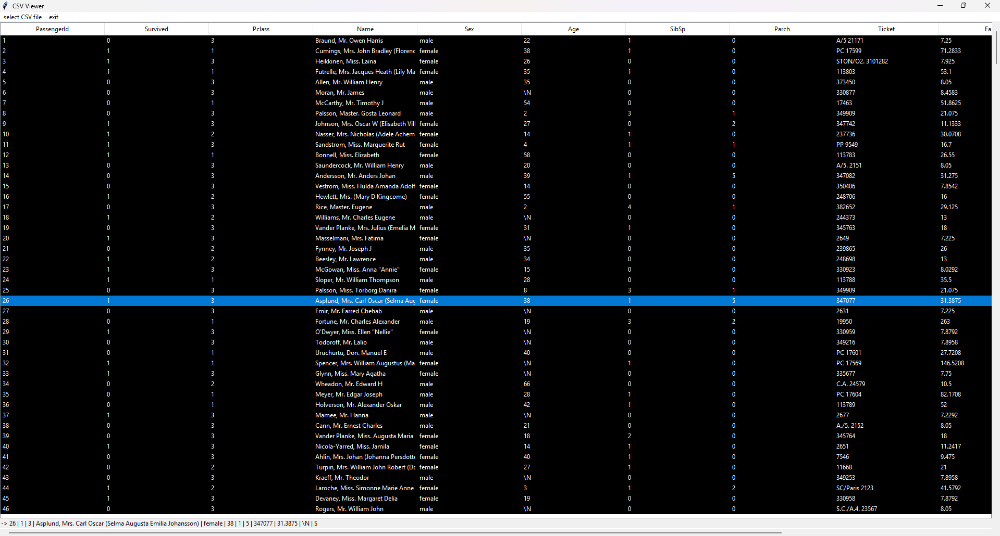

# CSV viewer
🖥️A simple GUI utility for CSV files view, built in tkinter.

| Demo screen |
| :----------------|
|  |
| <a href=".github/csvViewerAppDemo.png">See demo screen</a> |

# Utility setup

## 🖥️Clone this repo:
    git clone https://github.com/Maxdgf/CSV-viewer.git

## 🕹️Go to cloned repo:
    cd CSV-viewer

## 📃Install important libs:
    pip install -r requirements.txt

## 🔌Launch utility:
    python CsvViewerApp.py
